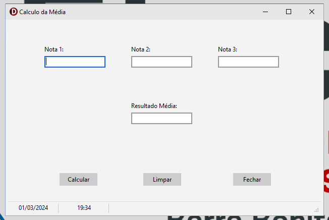
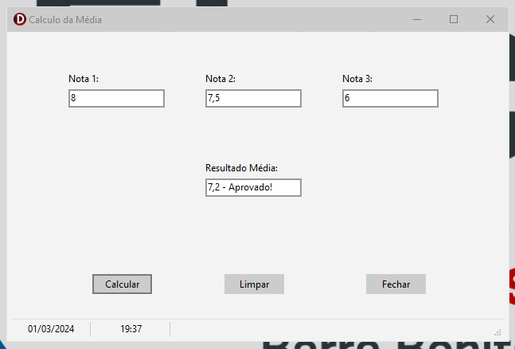
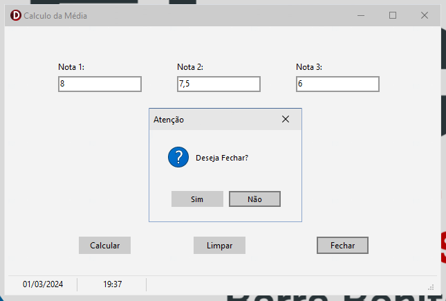

<h1 align="center">
  CalcMédia
</h1>

  
  
  

## 💻 Projeto:

Sistema simples voltado para calcular médias aritméticas.

## 🚀 Tecnologias utlizadas:

- [x] Delphi.

## 📔 Conhecimentos abordados:

- [x] Contato com Delphi;
- [x] Aprofundamento, codificação e aprendizado em Delphi;

